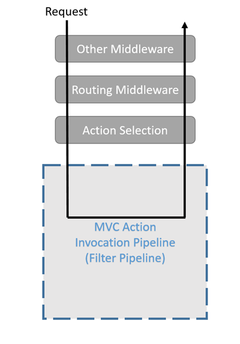
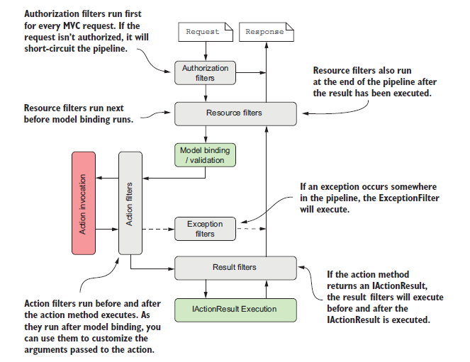

# Filters

**Definition**

*Filters* in ASP.NET Core MVC allow you to run code before or after specific stages in the request processing pipeline.

MVC Filters work like [middleware](https://docs.microsoft.com/en-us/aspnet/core/fundamentals/middleware/index?view=aspnetcore-2.2) in that they surround the execution of everything that comes later in the pipeline. But filters differ from middleware in that they're part of MVC, which means that they have access to MVC context and constructs. 

Filters can be easily applied to a subset of requests; for example, all actions on a single controller. Middleware doesn’t have this concept as a first-class idea (though you could achieve something similar with custom middleware components). 

Middleware is the more general concept, so has the wider reach. If the functionality you need has no MVC specific requirements, then you should use a middleware component. if you do need access to MVC constructs, or you want to behave differently for some MVC actions, then you should consider using a filter.

Filters run within the *MVC action invocation pipeline*, sometimes referred to as the *filter pipeline*. The filter pipeline runs after MVC selects the action to execute.

### Filter types

Each filter type is executed at a different stage in the filter pipeline.

- [Authorization filters](https://docs.microsoft.com/en-us/aspnet/core/mvc/controllers/filters?view=aspnetcore-2.2#authorization-filters) run first and are used to determine whether the current user is authorized for the current request. They can short-circuit the pipeline if a request is unauthorized.
- [Resource filters](https://docs.microsoft.com/en-us/aspnet/core/mvc/controllers/filters?view=aspnetcore-2.2#resource-filters) are the first to handle a request after authorization. They can run code before the rest of the filter pipeline, and after the rest of the pipeline has completed. They're useful to implement caching or otherwise short-circuit the filter pipeline for performance reasons. They run before model binding, so they can influence model binding.
- [Action filters](https://docs.microsoft.com/en-us/aspnet/core/mvc/controllers/filters?view=aspnetcore-2.2#action-filters) can run code immediately before and after an individual action method is called. They can be used to manipulate the arguments passed into an action and the result returned from the action. Action filters are not supported in Razor Pages.
- [Exception filters](https://docs.microsoft.com/en-us/aspnet/core/mvc/controllers/filters?view=aspnetcore-2.2#exception-filters) are used to apply global policies to unhandled exceptions that occur before anything has been written to the response body.
- [Result filters](https://docs.microsoft.com/en-us/aspnet/core/mvc/controllers/filters?view=aspnetcore-2.2#result-filters) can run code immediately before and after the execution of individual action results. They run only when the action method has executed successfully. They are useful for logic that must surround view or formatter execution.

The following diagram shows how these filter types interact in the filter pipeline.

